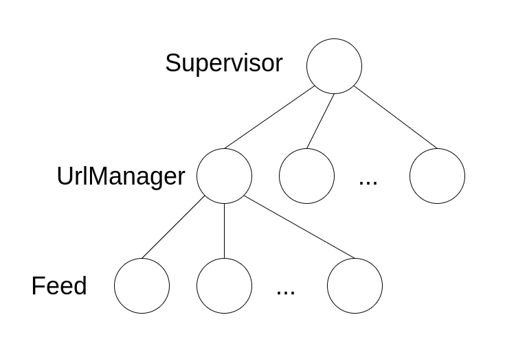
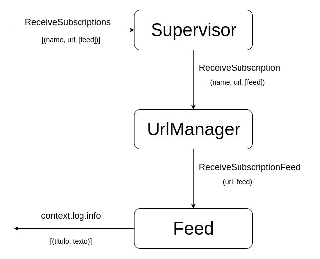

# Informe Lab3: Programación Concurrente Usando Actores en Scala

### Gonzalo Zigarán
> Paradigmas de la Programación 2021

## Arquitectura del Sistema

El diseño del sistema está inspirado en el diseño de la aplicación de la guía de iniciación de Akka, realizando un paralelismo entre los `Device` y los `Feed`, en el caso de la guía los `Devices` están agrupados en `DeviceGroup`; en este caso, vamos a agrupar a los `Feeds` por su url, en `UrlManager`. Todo supervisado por un `Supervisor`, en correspondencia con el `DeviceManager` de la guía. 

- **Supervisor**: este actor es el que gobierna el sistema, se encarga de la comunicación con lo externo y crea los `UrlManager` para cada url que lee del archivo de suscripciones. Este actor recibe una lista de subscripciones y para cada elemento de la lista, crea un actor `UrlManager`, enviándole la lista de feeds.

- **UrlManager**: este actor administra los feeds de un sitio, encargandose de crear los actores `Feed` que corresponde a cada feed. Este actor, recibe de `Supervisor` el url, y la lista de feeds, y con esa información crea un actor para cada feed.

- **Feed**: este actor está asociado a un único feed, y sus tareas son obtener los feeds para las especificaciones del actor e imprimirlos (más adelante, deberá devolverlo al `UrlManager`). Este actor recibe la url ya formada para su feed, y realiza la consulta, luego imprime en pantalla el resultado (más adelante debera devolverlo a `UrlManager`)

Los mensajes que se transmiten entre los actores planteados se puede ver reflejado en el siguiente gráfico, donde además se puede observar como se relaciona con el mundo exterior al sistema:

## Actores para subscribirse

## Request-Response

## Integración

## Investigación

### Si quisieran extender el sistema para soportar el conteo de entidades nombradas del laboratorio 2, ¿qué parte de la arquitectura deberían modificar? Justificar.

### Si quisieran exportar los datos (ítems) de las suscripciones a archivos de texto (en lugar de imprimirlas por pantalla):

#### ¿Qué tipo de patrón de interacción creen que les serviría y por qué? (hint: es mejor acumular todo los items antes de guardar nada).

#### ¿Dónde deberían utilizar dicho patrón si quisieran acumular todos los datos totales? ¿Y si lo quisieran hacer por sitio?

### ¿Qué problema trae implementar este sistema de manera síncrona?

### ¿Qué les asegura el sistema de pasaje de mensajes y cómo se diferencia con un semáforo/mutex?

## **Punto estrella:** Mejor modelo
